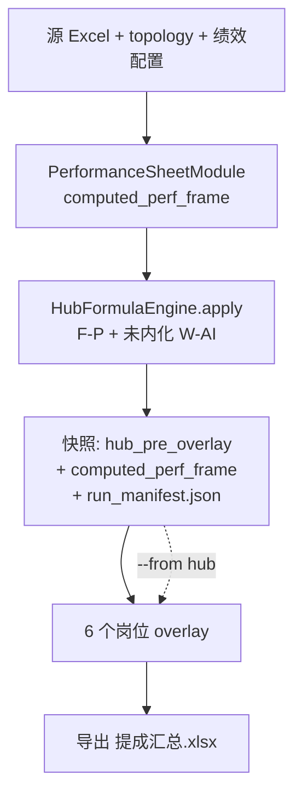

# 增量模板化算薪流水线（第一期 MVP）

> 在 `SalesPipeline` 上增加跨次运行缓存与阶段化入口，使改单个岗位计算器时无需全量重算 Hub 拓扑。

## 分层依赖

## 缓存目录

- 配置项：`month.yaml` → `outputs.cache_dir`（如 `output/2026-05/cache`）
- 缺省：`commission_summary_file` 同级 `cache/`

## 快照内容

| 文件 | 含义 |
|------|------|
| `hub_pre_overlay.parquet` | `HubFormulaEngine.apply` 之后、overlay 之前的提成汇总 |
| `computed_perf_frame.parquet` | 绩效整理表重算结果（供销售顾问等 overlay 使用） |
| `run_manifest.json` | 输入指纹、阶段、产物清单 |

无 `pyarrow` 时自动回退为 `.pkl` pickle 格式。

## 缓存失效规则

`cache_is_valid` 在 `--from hub` 前校验以下输入指纹：

- `workbooks.sales`
- `topology.sales`
- `config/performance_sheet_columns.yaml`
- `config/hub_performance.yaml`
- `month.yaml` 的 `performance_sheet` / `hub` 段
- `config/sales_advisor_roles.yaml`

任一变更 → 缓存失效，CLI 报错退出并提示先跑全量 `compute`。

## 命令对照

| 场景 | 命令 | 大致耗时 |
|------|------|----------|
| 完整重算 | `python main.py compute` | ~10–17 分钟 |
| 完整重算 + 对账 | `python main.py compute --reconcile` | ~10–17 分钟 |
| 仅对账（不重算） | `python main.py reconcile` | ~3–4 分钟 |
| 改单个岗位计算器 | `python main.py compute --from hub --only sales-advisor` | ~2–5 分钟 |
| 增量 + 对账 | `python main.py compute --from hub --only sales-advisor --reconcile` | ~5–8 分钟 |

### `--only` 岗位族

可重复指定，支持别名：

- `sales-advisor`（`sales_advisor`）
- `new-media`（`new_media`）
- `invite`
- `customer`
- `direct-store`（`direct_store`）
- `recruit`

未选中的 overlay 保留快照中的列值（上一轮 overlay 结果或 Hub bootstrap）。

## 风险与限制

1. **陈旧缓存**：manifest 硬校验，失效即报错，不会静默使用旧数据。
2. **未内化岗位**（如销售主管）：值来自 Hub 拓扑回放，`--from hub` 不会重算；改 Hub 公式逻辑须全量 `compute`。
3. **overlay 间依赖**：第一期 `--only` 仅覆盖相互独立的 6 个 overlay；销售顾问依赖 `computed_perf_frame`（随快照恢复）。
4. **第二期规划**：绩效整理表列级 slice 缓存、`hub_overrides.yaml` 统一覆盖层。

## 实现位置

- `salary_pipeline/pipelines/run_cache.py` — 指纹、manifest、快照
- `salary_pipeline/pipelines/sales.py` — `from_stage` / `only` 阶段入口
- `salary_pipeline/main.py` — CLI `--from` / `--only`
