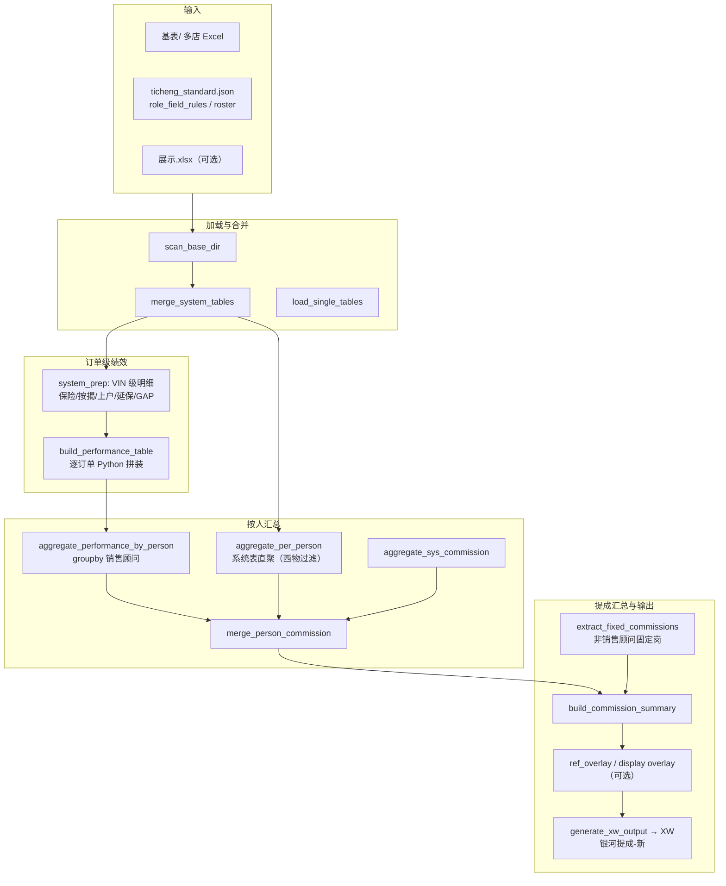
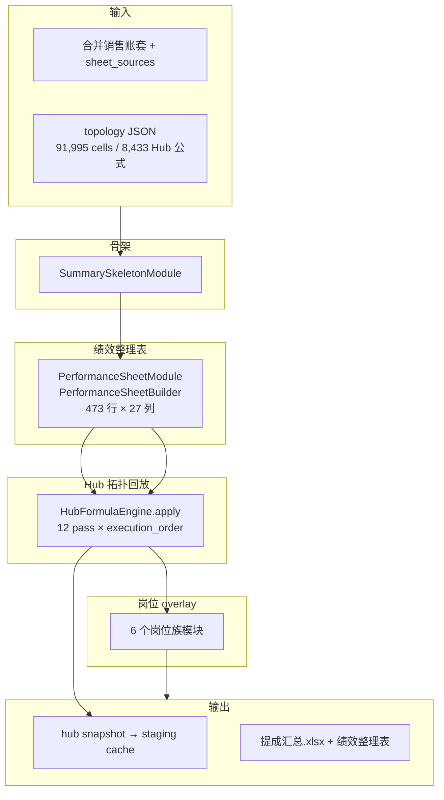

# xiwu_yeji_muban vs jx_muban_ranyouche 架构与速度对比

> 对比日期：2026-06-30  
> 快项目克隆路径：`/Users/macstudio2/Desktop/projects/xiwu_yeji_muban`（与 `jx_muban_ranyouche` 同级）  
> 快项目仓库：https://gitee.com/shibenshu/xiwu_yeji_muban

## 1. 结论摘要

| 维度 | xiwu_yeji_muban | jx_muban_ranyouche |
|------|-----------------|---------------------|
| **计算范式** | 纯 Python：`groupby` / 显式规则表 | Excel 拓扑回放：`HubFormulaEngine` 逐格 `_eval` |
| **范围** | 西物店 XW 银河提成（~25 人 datasheet） | 销售账套全表 + 6 岗位族 overlay + 对账体系 |
| **绩效整理表** | `build_performance_table` 订单级 Python（简化列） | `PerformanceSheetBuilder` 27 列闭包、473 行 |
| **提成汇总** | `aggregate_performance_by_person` + `build_commission_summary` | 8,433 个 Hub 公式 × 最多 12 pass |
| **实测耗时** | 全流水线 **~30 秒**（仓库自带 `基表/`） | 全量试算 **8–12 分钟**；增量 **2–5 分钟** |
| **正确性策略** | 规则简化 + 可选展示表/JSON overlay 补洞 | 与金标准零差异（拓扑反推） |

**核心速度差**：当前项目把 Excel 当成「解释器」回放 9 万格拓扑；快项目把 Excel 公式**编译成** pandas 聚合与配置驱动算子，且范围更窄。

---

## 2. xiwu_yeji_muban 架构

### 2.1 入口

| 入口 | 路径 | 用途 |
|------|------|------|
| CLI | `python -m pipeline.main` | 批处理 |
| Web | `web/app.py`（Flask） | 上传试算 / 预览 |
| 桌面 | `ui/app.py` + `run_ui.bat` | 本地界面 |

### 2.2 主流水线（`pipeline/main.py` → `run_pipeline`）

### 2.3 绩效 / 提成怎么算

**不是公式回放**，而是三层显式逻辑：

1. **订单级**（`pipeline/performance.py`）  
   - 以 `系统销售毛利` 为主表，按 VIN 关联 `system_prep` 预处理的保险/按揭等表。  
   - `_safe_sumif` / `_safe_lookup` 是 Python 版 SUMIF/INDEX-MATCH，非 Excel 解析。

2. **按人聚合**（`pipeline/perf_aggregate.py`）  
   - `perf_df.groupby('销售顾问')` 一次性 sum，等价于 Hub 里大量 `SUMIF(绩效整理表!…, 姓名, …)`。  
   - 整车绩效 = `SUM(单台绩效) × 销量完成率`（封顶 120%）。

3. **提成汇总**（`pipeline/summary.py`）  
   - 直接组装 dict 行，`_calc_commission_total` 纯 Python 加总。  
   - 非销售顾问走 `fixed_comm.py` 固定表。

**补洞机制**（快但不追求全链路重算）：

- `ref_overlay.py`：从 JSON 参考叠加考核/综合项（`fill_gaps` / `by_role`）。  
- `display_sources.py` / `xw_truth_overlay.py`：从加密 `展示.xlsx` 读核定真值。  
- 生产路径文档见 `基表到提成汇总映射.md`。

### 2.4 技术栈

- Python 3.10+，pandas + openpyxl + msoffcrypto（读加密展示表）  
- Flask / Streamlit 双 UI  
- **无** `topology.json`、**无** `HubFormulaEngine`、**无** 公式 `execution_order`

---

## 3. jx_muban_ranyouche 架构（试算路径）

试算入口：`salary_pipeline/ingestion_upload/trial_run.py` → `SalesPipeline.run(from_stage=full|hub)`。

增量设计见 `docs/design/incremental-pipeline.md`（v0.6.3 已接入上传页缓存）。

---

## 4. 速度对比：为什么快 / 为什么慢

### 4.1 xiwu 快的原因（源码 + 实测）

| 因素 | 说明 |
|------|------|
| **无拓扑回放** | 不存在 8,433 格 Hub 公式循环；`commission.py` 注释写明「直接从系统表聚合」。 |
| **Hub 语义一次 groupby** | `aggregate_performance_by_person` 替代数千次 SUMIF。 |
| **范围小** | 默认西物店 + datasheet ~25 人；输出 `XW银河提成-新`，非全账套。 |
| **规则简化** | 如保险 50/条、延保 200/条；少闭包列、少跨表依赖。 |
| **可选 overlay** | 难算字段从展示表/JSON 补，而非全链路重算。 |
| **实测** | `python -m pipeline.main --no-display-truth` ≈ **30s**（仓库 `基表/`） |

### 4.2 jx 慢的原因（有代码证据）

| 因素 | 量级 / 说明 |
|------|-------------|
| **HubFormulaEngine** | 8,433 Hub 公式 × 最多 12 pass；每格 `_eval` + 跨 sheet SUMIF/SUMIFS |
| **拓扑规模** | 91,995 cells（`销售账套-合并-2026-05.topology.json`） |
| **绩效整理表 Phase B** | 多明细 sheet、订单闭包、`enrich_order_context`；文档记载 builder 单独 3–10 分钟级 |
| **6 岗位 overlay** | 销售顾问等仍部分依赖 topology 解析 |
| **试算全量路径** | 新上传 → 指纹变 → `from_stage=full`；含绩效导出与多模块 |
| **对账** | `reconcile` 额外 3–4 分钟（试算默认不跑） |

### 4.3 正确性 vs 速度的权衡

- **xiwu**：快项目验收对 3 月参考 JSON 仍有 21/25 人差异（默认 `--no-display-truth` 跑法）；靠 overlay 拉近成品表。  
- **jx**：以金标准零差异为目标，拓扑回放是过渡态（见 `hub-绩效岗位分治.md` 终态：内化列、退役引擎）。

---

## 5. 可借鉴模式（按投入/收益排序）

### P0 — 高收益、低投入（上传试算立即可做）

| # | 建议 | 预期 | 状态 |
|---|------|------|------|
| 1 | **Hub 缓存增量试算** | 第二次试算 2–5 min | ✅ `trial_run.py` |
| 2 | **试算跳过绩效 xlsx 导出** | 省 30s–2min | 可加 `export_performance_sheet=False` 默认 |
| 3 | **试算 `--only` 关键 overlay** | 预览只关心销售顾问时跳过 5 个模块 | CLI 已有，上传页可暴露 |
| 4 | **正式 cache bootstrap staging** | 同月重传走 hub | ✅ 已实现 |

### P1 — 高收益、中投入（对齐 xiwu 核心思路）

| # | 建议 | 做法 | 预期 |
|---|------|------|------|
| 5 | **绩效整理表 → 按人预聚合** | 对 `computed_perf_frame` 按 `P(顾问)` 一次性 `groupby.sum`，Hub 读聚合表 | Hub 阶段 **5–10×** |
| 6 | **试算「快速模式」** | `use_golden_perf_sheet=true` 或只算 F–P + 销售顾问 W 列 | 首次 **3–5 min** |
| 7 | **列级 slice 缓存** | `incremental-pipeline.md` 第二期 parquet | 改单表免全量 builder |
| 8 | **批量化高频 `_eval`** | 识别 `SUMIFS(绩效整理表!…, P, 顾问)` 模式向量化 | 减 Python 循环 |

### P2 — 高收益、高投入（终态）

| # | 建议 | 对齐文档 |
|---|------|----------|
| 9 | **岗位列纯 Python 内化** | `hub-绩效岗位分治.md`、`PHASE-B-PLAN.md` Phase C |
| 10 | **退役 HubFormulaEngine** | 销售顾问 W–AI 迁入 `calculators/sales_advisor/` |
| 11 | **试算闭包子集拓扑** | `closure_report.py` 输出最小 sheet 集，试算不加载 92k 格 |

### P3 — 体验层

- 后台 job + 轮询（避免 Streamlit 阻塞 10 分钟）  
- 分阶段 `st.status` 进度（已有）  

---

## 6. 两项目对照表（实现层）

| 能力 | xiwu_yeji_muban | jx_muban_ranyouche |
|------|-----------------|---------------------|
| 订单级绩效 | `performance.build_performance_table` | `PerformanceSheetBuilder.build` |
| 按人 SUMIF | `perf_aggregate.aggregate_performance_by_person` | `HubFormulaEngine._eval_sumif*` |
| 整车绩效标准 | `ticheng_standard.json` + `DeptMapping` | 拓扑 + `commission_rules` |
| 非销售岗 | `fixed_comm.extract_fixed_commissions` | 6× `*_performance.py` overlay |
| 综合项/考核 | `ref_overlay` / `display_sources` | Hub 列 + overlay + 金标准 |
| 输出 | `XW银河提成-新.xlsx` | `提成汇总.xlsx` + 绩效整理表 + 对账报告 |
| Web 试算 | Flask `web/app.py` 同步调 `run_pipeline` | Streamlit `0_发薪上传.py` → `run_trial_compute` |

---

## 7. 验证清单（后续）

- [ ] 同一份 2026-05 西物数据，两端 wall time 对比（需统一输入集）  
- [ ] 抽样 10 人 W–AI 列差异归因：拓扑 vs groupby 规则差  
- [ ] 在 jx 实现 P1#5 原型并 profiling `HubFormulaEngine.apply`  
- [ ] 上传页增加「快速预览 / 完整试算」开关  

---

## 8. 参考文件

**xiwu_yeji_muban**

- `pipeline/main.py` — 主流水线  
- `pipeline/performance.py` — 订单级绩效  
- `pipeline/perf_aggregate.py` — 按人 groupby  
- `pipeline/commission.py` — 系统表直聚  
- `基表到提成汇总映射.md` — 字段映射说明  

**jx_muban_ranyouche**

- `salary_pipeline/pipelines/hub_formula_engine.py`  
- `salary_pipeline/pipelines/sales.py`  
- `salary_pipeline/ingestion_upload/trial_run.py`  
- `docs/design/incremental-pipeline.md`  
- `docs/design/hub-绩效岗位分治.md`  
