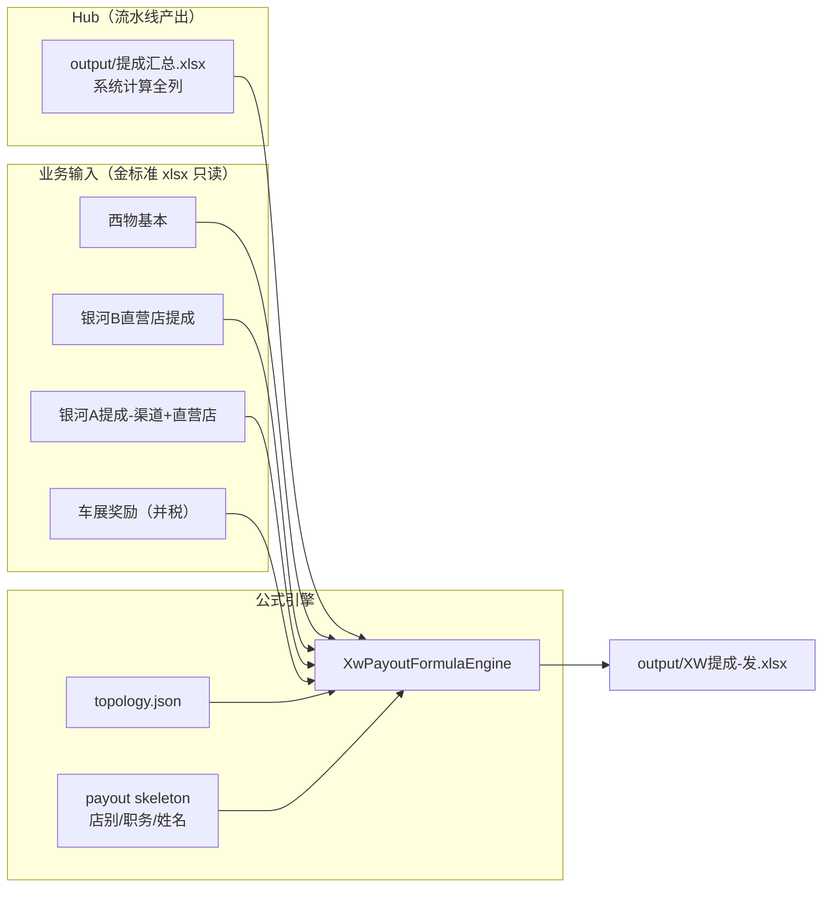

# 发薪表（提成-发）流水线

> 承接 Hub（`提成汇总`）之后的最终财务发薪输出。迭代 4 / 4+ 已实现三渠道；本文档汇总数据流与运行方式。

**最后更新：** 2026-07-09

---

## 状态一览

| 渠道 | 输出文件 | 基本表 | 引擎配置 | CLI | 对账 | 状态 |
|------|----------|--------|----------|-----|------|------|
| 西物超市 | `XW提成-发.xlsx` | 西物基本 | `XW_CONFIG` | `--channel xw`（默认） | `payout_parity` | ✅ |
| 直营店 | `直营店提成-发.xlsx` | 直营店基本 + 综合表等 | `DIRECT_STORE_CONFIG` | `--channel direct_store` | `direct_store_parity` | ✅ |
| 超市 CS | `CS提成-发.xlsx` | 超市基本 | `CS_CONFIG` | `--channel cs` | `cs_parity` | ✅ |

另有 **XW提成-翼真发**（翼真店专用），闭包与 XW 类似但骨架不同，尚未单独接线。

---

## 数据流（以 XW提成-发 为例）



### 原则

1. **`提成汇总` 是 OUTPUT**：流水线生成 `output/YYYY-MM/提成汇总.xlsx`，不作为业务输入导入（仅对账时与金标准比对）。
2. **发薪 SUMIF 源**（`hub_frame_loader.build_hub_sumif_frame`）：
   - **仅** `output/提成汇总.xlsx`（系统计算值，含 F–P 与 W–AR）
   - **禁止**金标准 W–AR 引导层合并；computed 缺失时 SUMIF 数值列为空
   - 自动检测图例行偏移（`detect_hub_data_start_row`）
3. **骨架行**：`read_payout_skeleton` 从金标准发薪表读 B/C/D（店别、职务、姓名），不读数值列。
4. **手工填入**：Hub 无公式格标浅灰 `#D9D9D9`（需要手工填入），不回读金标准数值掩盖差异。
5. **不实现 Excel 环**：Hub BB/BC 回引各「发」表的对账环路由 parity 层处理，引擎不回放。

---

## 各渠道基本表与 SUMIF 来源

### XW提成-发（`XW_CONFIG`）

| 来源 sheet | 用途 | 典型公式 |
|------------|------|----------|
| **提成汇总** | 考核量 F/G、绩效 W–AI、扣税 AK–AR | `SUMIF(提成汇总!D:D,Dn,提成汇总!W:W)` |
| **西物基本** | 基本工资 AI、社保 AK、公积金 AL、代扣 AQ | `SUMIF(西物基本!C:C,Dn,西物基本!P:P)` |
| **银河B直营店提成** | 代发放 AG、年终 AI | `SUMIF(…!F:F,Dn,…!AI:AI)` |
| **银河A提成- 渠道+直营店** | 代发放 AH | `SUMIF(…!F:F,Dn,…!AH:AH)` |
| **车展奖励（并税）** | 其它 AJ | `SUMIF(…!L:L,Dn,…!V:V)` |
| 行内算术 | 提成合计 U、应发 AE、实发 AH/AS | `SUM(H:T)`、`AE=U+AD` 等 |
| 个税表（金标准引导） | AN 个人所得税 | `INDEX(BA:BA,MATCH(Dn,AZ:AZ,0))` |

**西物翼真**：闭包中出现在部分行（翼真店基本工资），当前引擎通过金标准 `WorkbookLoader` 直读；翼真专用表为 `XW提成-翼真发`。

### 直营店提成-发（`DIRECT_STORE_CONFIG`）

在 XW 基础上增加：

| 来源 sheet | 用途 |
|------------|------|
| **直营店基本** | 同西物基本列模式（P/AB/AC/AG/AA/AE） |
| **综合表** | Hub AM/AP 相关综合项 |
| **超市公积金** | 公积金代扣 |
| **服装扣款明细** | 其他扣款 |
| **银河 A/B** | **代发放绩效(银河A+B)** AG 列（直营店经理 5 人） |

### CS提成-发（`CS_CONFIG`）

| 差异点 | 说明 |
|--------|------|
| 基本表 | **超市基本**（非西物基本） |
| 个税 lookup | `INDEX(BB,MATCH(D,BA))`（非 XW 的 AZ/BA） |
| 列映射 | N→附加5绩效、T→交强险提成等 |

---

## 核心代码路径

| 模块 | 路径 |
|------|------|
| 多渠道流水线 | `salary_pipeline/pipelines/xw_payout.py` → `ChannelPayoutPipeline` |
| 公式引擎 | `salary_pipeline/pipelines/xw_payout_formula_engine.py` |
| Hub SUMIF 合并 | `salary_pipeline/data_ingestion/hub_frame_loader.py` |
| 骨架读取 | `salary_pipeline/modules/payout_skeleton.py` |
| 基本工资加载 | `salary_pipeline/modules/payroll_merge.py` |
| 月度配置 | `salary_pipeline/config/month.yaml` → `payout` / `*_parity` |
| 表角色登记 | `salary_pipeline/config/sheet_registry.yaml` |
| 闭包分析 | `docs/iterations/iteration-2026-05/artifacts/closure_XW提成-发.md` |

---

## 命令

```bash
# 前提：已有 output/2026-05/提成汇总.xlsx（先跑 compute 或 compute-all）

# XW 发薪（默认 computed hub 全列 SUMIF）
python main.py compute-payout --reconcile

# --golden-hub 已废弃（仍接受参数但忽略，始终用 computed hub）

# 直营店 / CS
python main.py compute-payout --channel direct_store --reconcile
python main.py compute-payout --channel cs --reconcile

# 端到端：Hub → 三渠道发薪 + 全量对账
python main.py compute-all --reconcile

# 仅对账（不重算）
python main.py reconcile-payout
python main.py reconcile-payout --channel direct_store
```

### 配置开关

`month.yaml`:

```yaml
payout:
  use_computed_hub: true   # 发薪 SUMIF 仅读 output/提成汇总.xlsx（全列）
  data_start_row: 3
  xw:
    anchor_sheet: "XW提成-发"
    golden_workbook: "data/raw/.../销售提成(终).xlsx"  # 仅骨架/对账，非 SUMIF 数据源
```

### 唐操（2026-05）说明

金标准 Hub 行 94 的 **整车绩效 W**、**权限结余绩效 X** 为手工常数（topology 无公式）。废除金标准覆盖后：

| 来源 | 整车绩效 | 权限结余绩效 |
|------|----------|--------------|
| 金标准 Hub | 1046.15 | -1252.15 |
| 系统计算 Hub | 861.54 | -952.15 |
| 发薪 XW F/G（修复后） | 861.54 | -952.15 |

发薪表 F/G 通过 `SUMIF(提成汇总!D:D, Dn, 提成汇总!W:W/X:X)` 拉取 **computed hub**；与金标准差异应在对账报告中可见，不应被金标准引导层隐藏。

---

## 对账列（2026-05）

对账完成后会在 **系统生成的发薪 xlsx** 上写入色块与批注（与提成汇总对账 UX 一致）：

| 色块 | 含义 |
|------|------|
| 浅灰 `#D9D9D9` | 金标准中无公式、需手工填入（topology 检测，不拷贝数值） |
| 琥珀 `#FFEB9C` | 与金标准数值不一致；批注含 `金标准 \| 系统 \| 差` |

图例行插入在表头上方（第 2 行）。`payout_parity.auto_highlight: false` 可关闭。

| 渠道 | parity 键 | 核心列 |
|------|-----------|--------|
| XW | `payout_parity` | 考核量、销售数量、整车绩效、提成合计、应发放合计、实际发放、基本工资、实际发放_AS、年终绩效 |
| 直营店 | `direct_store_parity` | + 代发放绩效(银河A+B) |
| CS | `cs_parity` | 同 XW（无 AG 专项） |

验收标准：店别+职务+姓名 join，容差 `1e-4`，**12/12 店别全绿**（2026-05）。

---

## 测试

```bash
python -m unittest tests.test_xw_payout_formula_engine -v
python -m unittest tests.test_hub_frame_loader -v
python -m unittest tests.test_direct_store_payout tests.test_cs_payout -v
python -m unittest tests.test_compute_all -v
```

---

## 后续工作

| 优先级 | 事项 | 说明 |
|--------|------|------|
| P1 | 扩展 hub 覆盖至 W–AI | `COMPUTED_HUB_OVERRIDE_LETTERS` 现仅 F–P；算薪六族 W–AI 已过 parity_gate，可逐步用计算版覆盖 |
| P2 | XW提成-翼真发 | 独立 channel + `西物翼真` 基本表 |
| P3 | 个税模块内化 | 现 AZ/BA（XW）、BE/BF（直营店）、BA/BB（CS）仍金标准引导 |
| P4 | 基本表系统化 | 西物基本 / 超市基本 / 直营店基本 从 HR 源重算，脱离金标准 xlsx |
| P5 | 发薪 parity 扩列 | F–AS 全列硬门禁（现 9–10 列核心指标） |

## 相关文档

- [提成汇总-列级计算规则.md](../hub/提成汇总-列级计算规则.md) — **按 Hub 列**：F–P / W–AI 计算规则与底层表追溯（HubRuleEngine 重构后）
- [发薪表-岗位取数与计算逻辑.md](./发薪表-岗位取数与计算逻辑.md) — **按发薪表列**：各岗位取数位置与计算逻辑
- [提成汇总-底层表清单.md](./提成汇总-底层表清单.md) — Hub 生成所需底层 sheet 分类清单（跨月外推）
- [iteration-4/README.md](../iteration-4/README.md) — XW 首版
- [iteration-4-plus/README.md](../iteration-4-plus/README.md) — 直营店 / CS
- [closure_XW提成-发.md](../iteration-2026-05/artifacts/closure_XW提成-发.md) — 依赖闭包
- [下一步应该做什么.md](../../下一步应该做什么.md) — 总进度
