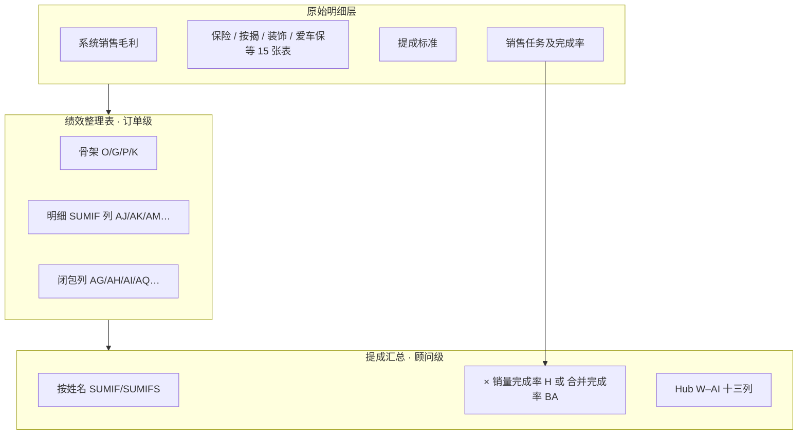

# 销售顾问计算逻辑说明

**账期样板：** 2026-05  
**适用范围：** `提成汇总` 表中 **职务 = 销售顾问** 的 Hub 绩效列（W–AI，共 13 列）  
**读者：** 财务对账、算薪开发、业务复核  
**最后更新：** 2026-07-01

**相关文档：**

- [HUB-W-AI-列级溯源.md](./HUB-W-AI-列级溯源.md) — 十三列逐列溯源（字母列对照）
- [绩效整理表-系统生成-数据源.md](./绩效整理表-系统生成-数据源.md) — 订单级 25 列如何由明细重算
- [权限结余与绩效特殊情形汇报.md](./权限结余与绩效特殊情形汇报.md) — AH / X 列已知个案与修复状态
- [README.md](./README.md) — 迭代阶段与验收命令

---

## 1. 读本文档前先知道的三件事

### 1.1 一句话概括

销售顾问的 Hub 绩效，本质是：**先把每笔订单算进「绩效整理表」，再按顾问姓名汇总，部分列再乘完成率或加常数**。

### 1.2 三层数据流



### 1.3 同名不同表 — 务必分清

| 中文名 | 绩效整理表（订单级） | 提成汇总（顾问级） |
|--------|---------------------|-------------------|
| 单台绩效 / 整车绩效 | **AG** 列：每笔订单的整车提成 | **W** 列：顾问最终整车绩效 |
| 整车超额 / 权限结余 | **AH** 列：每笔订单的权限结余 | **X** 列：顾问权限结余绩效 |
| 加装绩效 | **AI** 列 | **Y** 列 |
| 座位险 | **AO** 列 | **AG** 列（Hub 表头也叫座位险提成） |

下文凡写「整理表 XX 列 → Hub YY 列」，均指上表对应关系。

---

## 2. 总体公式链（业务语言）

对 **49 名 hub_linked 销售顾问**（`sales_advisor_roles.yaml` 登记），典型计算模式如下。

### 2.1 带完成率的列（乘 H 或 BA）

| Hub 列 | 中文名 | 公式链（业务语言） |
|--------|--------|-------------------|
| **W** | 整车绩效 | 该顾问全部订单 **单台绩效（AG）** 相加 → × **完成率**（个人用 H，门店块用 BA） |
| **Y** | 加装绩效 | 全部订单 **加装绩效（AI）** 相加 → × **销量完成率（H）** |
| **Z** | 保险绩效 | 全部订单 **保险提成（AJ）** 相加 → × **H**（个别顾问再 **+ 常数**，如韩柏成 +600） |

**整车绩效完整链（每笔订单）：**

```text
车型（H）+ 销售渠道（I）+ 指标汇总部门（A）
    → 查「提成标准」2026年标准（F 列）→ × 台数（K）= 单车单台绩效（AG）
    → 按顾问姓名（P）SUM = 单车绩效合计
    → × 完成率（H 最高 120%，或门店块 BA 最高 110%）= Hub 整车绩效（W）
```

**特例：** 指标汇总部门 = 武侯自有店 且 车种 = 星越L → 固定 **200 元/台 × K**，不走提成标准 lookup。

### 2.2 直接汇总、不乘完成率的列

| Hub 列 | 中文名 | 公式链 |
|--------|--------|--------|
| **X** | 权限结余绩效 | SUM（整车超额 AH）— **不乘完成率** |
| **AA** | 金融绩效 | SUM（按揭提成 AK） |
| **AB** | 爱车宝绩效 | SUM（爱车宝 AM） |
| **AC** | 上户绩效 | SUM（上户绩效 AN）+ SUM（置换服务 AS）— 双项相加 |
| **AD** | 盈利产品绩效 | SUM（盈利产品 AL） |
| **AE** | 延保提成 | SUM（延保提成 AT） |
| **AF** | 特殊车型+指定车型 | SUM（特殊车型追加绩效 AQ） |
| **AG** | 座位险提成 | SUM（座位险绩效 AO） |
| **AH** | 二手车提成 | SUM（二手车置换 AR） |
| **AI** | 玻碎险提成 | SUM（玻璃险绩效 AP） |

### 2.3 完成率三种版式

| 版式 | 怎么识别（Hub 公式） | W 整车 | Y 加装 / Z 保险 |
|------|---------------------|--------|----------------|
| **个人完成率** | `SUMIFS(AG)×H` | AG 合计 × **H** | AI/AJ 合计 × **H** |
| **门店块** | `SUMIFS(AG)×BA` | AG 合计 × **BA** | 仍 × **H**（不加 BA） |
| **保险常数** | `SUMIFS(AJ)+600` | 不乘完成率 | AJ 合计 × H **+ 常数** |

样例：**何宇**（个人 H）、**唐鹏**（门店 BA）、**韩柏成**（保险 +600）。

---

## 3. 完成率怎么来（H / BA）

完成率 **不是** 在绩效整理表里算的，而在 **提成汇总** 行上，来自任务完成情况。

### 3.1 销量完成率（H 列）

```text
考核量（F）← SUMIF(销售任务及完成率, 姓名, 考核量)
实际销量（G）← SUMIF(销售任务及完成率, 姓名, 实际销量)
销量完成率（H）= IF(F≠0, MIN(实际/考核, 封顶), 0)
```

**封顶规则（按人不同，读 Hub topology 公式）：**

| 公式模式 | 封顶 | 典型顾问 |
|----------|------|----------|
| `IF(G/F>120%, 120%, G/F)` | **120%** | 何宇（H92）等多数个人顾问 |
| `IF(G/F>110%, 110%, G/F)` | **110%** | 部分门店块 / 其他版式 |

代码：`HubTaskMetricsCalculator`（`hub_task_metrics.py`）+ `ratio_with_cap`。

### 3.2 合并完成率（BA 列，门店块）

```text
合并完成率（BA）= SUMIF(销售任务及完成率, 姓名, AG列)
```

门店块顾问的 **整车绩效（W）** 乘 BA，**不加** 个人 H；加装、保险仍乘个人 H。

配置登记：`sales_advisor_roles.yaml` → `store_block_pattern.multiply_ref_prefix: BA`。

---

## 4. 分项计算逻辑

### 4.1 整车绩效（W ← AG）

**订单级（绩效整理表 AG / 单台绩效）：**

```text
每笔订单：
  系统销售毛利 → 车种 H、渠道 I、部门 BL
      → 比对表 → 指标汇总部门 A
      → 提成标准（部门 C × 渠道 D × 车型 E）→ 2026年标准 F
      → F × 台数 K = AG
  特例：A=武侯自有店 且 H=星越L → 200 × K
```

**顾问级（Hub W）：**

```text
SUMIFS(绩效整理表!AG, P, 姓名) × H   （个人顾问）
SUMIFS(绩效整理表!AG, P, 姓名) × BA  （门店块，如唐鹏 W4）
```

**原始表：** 系统销售毛利、比对表、`提成标准`（JSON：`销售提成标准.json`，164 条规则混排多职务）。

**观察台：** 算薪 → 销售顾问 →「整车绩效明细」支持订单级下钻（`vehicle_performance_detail.py`）。

---

### 4.2 权限结余绩效（X ← AH）— SUMIFS 特殊情形

权限结余是 **唯一** 在订单级就有复杂分支、且 Hub **绝不乘完成率** 的大项。

**Hub 层：**

```text
权限结余绩效（X）= SUMIFS(绩效整理表!AH, P, 姓名)
```

**订单级（AH / 整车超额）：**

```text
先算权限链：
  整车节约 V ← 系统超额（按 VIN）
  经理权限 X ← 常数（样本月 59 笔 VIN×1000，YAML allowlist）
  按揭扣除 Z ← 按揭原表
  实际整车节约权限 AA = IF(Z≠0, 0, Y−Z)，其中 Y = V + X

再算 perf_sum = AG + AI + AJ + AK（同单四项绩效之和）

分支（渠道 D 由 A + I 派生）：
  · 分公司 / 网络部 / 二网 / 大客户 → 不算（空白）
  · 月末服务补录行（G=置换服务、上户收入等）→ 不算（空白）
  · 直营店店面 / 自有店 且 AA>0 → AH = AA × 20%
  · 否则若 AA×14% + perf_sum < 150 → AH = 150 − perf_sum（保底）
  · 否则 直营店 / 自有店 → AH = AA × 14%
```

**与 SUMIF 的区别：** 逻辑在 **闭包** `from_closure.py::_compute_ah` 内化，不是简单 SUMIF 一张明细表；Hub 只做按人求和。

**已知个案：** 赵思梵 AA×0.4、易花贞子 +100 尾项、负 AA 翼真店留空等 — 见 [权限结余与绩效特殊情形汇报.md](./权限结余与绩效特殊情形汇报.md)。

---

### 4.3 加装绩效（Y ← AI）

**订单级：**

```text
若 台数 K = 0（或无台数）→ 订单合计含税 L × 12%
若 K ≠ 0 且 (精品最低价 S − 不提成精品 U) > 0 → (S − U) × 12%
否则 0

U 来自装饰台账：按订单号 G 汇总指定精品名称的「不提成」金额
服务补录行（如上户收入）→ AI = 0
```

**顾问级：**

```text
SUMIFS(绩效整理表!AI, P, 姓名) × H
```

部分顾问公式带 **排除车种**：`SUMIFS(AI, P, 姓名, H, "<>新博瑞") × H`（崇州块等）。

---

### 4.4 保险绩效（Z ← AJ）

**订单级：**

```text
按 VIN（O）← SUMIF(保险明细, 车架号, 提成金额 BS) = AJ
```

**顾问级：**

```text
SUMIFS(绩效整理表!AJ, P, 姓名) × H
（可选）+ 常数，如韩柏成：SUMIFS(AJ)+600
（可选）排除新博瑞车种，再 × H
```

**乘完成率：** 是（H）。  
**不乘完成率的情形：** 无；常数是加在 SUMIFS 之后、与 H 无关的固定调整。

---

### 4.5 金融绩效（AA ← AK）

```text
订单级：VIN → SUMIF(按揭明细, VIN, 基础绩效 BO) = AK
顾问级：SUMIF/SUMIFS(AK, P, 姓名) — 不乘完成率
```

---

### 4.6 爱车宝绩效（AB ← AM）

```text
订单级：VIN → SUMIF(爱车保, VIN, 爱车宝提成金额) = AM
顾问级：SUMIFS(AM, P, 姓名) — 不乘完成率
```

---

### 4.7 上户绩效（AC ← AN + AS）

**双 SUMIF 链（Hub 典型公式）：**

```text
SUMIF(绩效整理表!AN, P, 姓名) + SUMIF(绩效整理表!AS, P, 姓名)
```

| 整理表列 | 来源 |
|---------|------|
| AN 上户绩效 | 上户提成（VIN → 提成金额） |
| AS 置换服务 | 置换服务（VIN → 提成金额） |

**不乘完成率。** 引擎须识别链式两段 SUMIF（何宇 AC92 修复案例）。

---

### 4.8 盈利产品绩效（AD ← AL）

```text
订单级：VIN → 按揭原表盈利性奖励 + 按揭明细吉致追加 = AL
顾问级：SUMIFS(AL, P, 姓名) — 不乘完成率
```

---

### 4.9 延保提成（AE ← AT）

```text
延保收入 AF ← SUMIF(延保提成, VIN, 收入列)
延保提成 AT = IF(AF<0, -200, IF(AF>0, +200, 0))   （按单 ±200 台阶）
顾问级：SUMIFS(AT, P, 姓名) — 不乘完成率
```

---

### 4.10 特殊车型+指定车型（AF ← AQ）

```text
每笔订单：
  重功超期+活动台账追加奖励
  + 提成标准「政策追加」列 H × 台数 K
    （同样 部门×渠道×车型 三维匹配）
顾问级：SUMIFS(AQ, P, 姓名) — 不乘完成率
```

---

### 4.11 座位险 / 二手车 / 玻碎险（Hub AG / AH / AI）

| Hub 列 | 整理表源列 | 订单级来源 | 乘完成率 |
|--------|-----------|-----------|----------|
| AG 座位险提成 | AO | 保险明细 BU | 否 |
| AH 二手车提成 | AR | 二手置换 + 大客户 | 否 |
| AI 玻碎险提成 | AP | 保险明细 BV | 否 |

---

## 5. 绩效整理表如何生成（Phase B）

系统 **不读** 金标准「绩效整理表」数值，由 `PerformanceSheetBuilder.build()` 从 15 张 input 表重算。

```text
系统销售毛利（筛选当月整车订单 + 服务补录）
    → 骨架 G/O/P/K
    → 明细 SUMIF：AJ/AK/AL/AM/AN/AS/AO/AP/AB…
    → enrich_order_context（H/I/A/D/L/S/U/V/AA 等中间字段）
    → compute_closure_columns → AG/AH/AI/AQ/AR
    → computed_perf_frame → 注入 Hub 公式引擎 / 销售顾问模块
```

导出：`python main.py export-performance-sheet` → `output/<月>/绩效整理表-系统生成.xlsx`。

---

## 6. Hub 层技术实现（两套路径）

### 6.1 拓扑回放（Phase A，生产默认）

`HubFormulaEngine` 读取 `data/topology/<月>/销售账套-*.topology.json`，按 Excel 公式依赖顺序回放 W–AI。

- 支持：`SUMIF`、`SUMIF+SUMIF` 链、`SUMIFS×单元格`、`SUMIFS+常数`、排除车种 `H<>"新博瑞"`
- **不解析** 164 条提成标准本身；标准已在整理表 AG/AQ 闭包中体现

### 6.2 业务模块（Phase C）

`SalesAdvisorPerformanceModule` → `calculators/sales_advisor/`：

1. `topology_specs.load_row_specs(hub_excel_row)` — 按 **Hub 行号** 解析公式为 `HubColumnFormula`
2. `formulas.eval_hub_column` — 对 `computed_perf_frame` 做 SUMIF/SUMIFS + `resolve_multiplier(H/BA)`
3. 无公式格 → `bootstrap_from_golden` 时可回读金标准静态值

**parity_gate 硬门禁列（`hub_columns` 登记 8 列）：** 整车、加装、保险、延保、特殊车型、金融、爱车宝、上户。

---

## 7. 例外、手工格与 hub_excel_row

### 7.1 hub_excel_row

每位 hub_linked 顾问在 `sales_advisor_roles.yaml` 登记 **金标准 Excel 行号**（如何宇 = 92）。用途：

- 解析该行 W–AI 的 topology 公式（版式因行而异）
- 观察台金标准对照、`lookup_golden_hub`
- 对账时校验姓名与行号不错位（如刘波行修复）

匹配 Hub 行时以 **姓名 + 职务** 为主；49/51 人店别为空，店别仅辅助。

### 7.2 手工格与暂缓对账（wa_parity_deferred）

| 顾问 | 列 | 说明 |
|------|-----|------|
| 韩柏成 | 整车 / 保险 / 加装 | 翼真店 AG 与提成标准不一致；Z=SUMIFS+600；Y=1000 静态 |
| 沈燕1 | 整车 / 保险 | 翼真金标准手工 |
| 唐操 | 整车 | 渠道 I 个案致 AG lookup 偏差 |

对账标 **浅蓝 deferred**；`topology_specs.is_manual_formula_adjustment` 自动检出 `+600`、`-100` 等尾项常数。

### 7.3 翼真店与其他金标准直填

部分顾问 Hub 格为 **纯常数**（无单元格引用），标 **浅灰 static fill**，系统 `bootstrap_from_golden` 时回读金标准值，不做业务复算。

### 7.4 仅子表、不进 Hub

`销售提成标准.json` 有 53 条顾问记录，但仅约 49 人 `hub_linked: true`。  
如 **徐荣尧**：子表算薪，`hub_linked: false`，不写提成汇总 W–AI。

---

## 8. 乘完成率 vs 直接 SUM — 速查表

| Hub 列 | 整理表源 | 乘 H | 乘 BA | 其他 |
|--------|---------|:----:|:-----:|------|
| W 整车 | AG | ✓（个人） | ✓（门店块） | |
| X 权限结余 | AH | | | 直接 SUM |
| Y 加装 | AI | ✓ | | 可排除车种 |
| Z 保险 | AJ | ✓ | | 可 +常数；可排除车种 |
| AA 金融 | AK | | | 直接 SUM |
| AB 爱车宝 | AM | | | 直接 SUM |
| AC 上户 | AN+AS | | | 双 SUMIF 链 |
| AD 盈利产品 | AL | | | 直接 SUM |
| AE 延保 | AT | | | 直接 SUM |
| AF 特殊车型 | AQ | | | 直接 SUM |
| AG 座位险 | AO | | | 直接 SUM |
| AH 二手车 | AR | | | 直接 SUM |
| AI 玻碎险 | AP | | | 直接 SUM |

---

## 9. 逻辑内化程度与已知缺口

| 层级 | 状态 | 说明 |
|------|------|------|
| 绩效整理表明细 SUMIF 列 | ✅ 已内化 | AJ/AK/AM/AN/AS 等 Phase B 验收通过 |
| 闭包列 AG/AI/AQ | ✅ 已内化 | 提成标准 lookup + 装饰/活动规则 |
| 闭包列 AH（权限结余） | ⚠️ 大部分内化 | 剩余 6 人订单级个案（负 AA、手工比例、渠道映射） |
| Hub W–AI 汇总 + 完成率 | ✅ 拓扑回放零差异 | `HubFormulaEngine` / `formulas.py` 与金标准对齐 |
| Hub W–AI 纯业务模块 | ⚠️ 依赖 topology | `load_row_specs(excel_row)` 仍读拓扑 JSON，非独立 YAML 规则表 |
| 销售提成标准 JSON | 📋 人员名册 | 164 条混排；**不**直接驱动 Hub 公式，驱动 AG/AQ 闭包 |
| F–P 指标层（考核量、毛利等） | ⏳ 部分待内化 | 与 W–AI 绩效层分离；不影响 AD 盈利产品闭包 |

**仍偏 topology-replay、未完全业务内化的部分：**

1. **Hub 列公式形态** — 每人 W–AI 公式来自 topology，非 `commission_rules` 显式配置  
2. **完成率封顶 120%/110%** — 按行读 topology 的 H 公式，非统一配置项  
3. **手工 AH / 翼真 / 常数格** — 依赖 deferred 登记或金标准 bootstrap  
4. **AQ 特殊车型** — 闭包已有，但与金标准仍有 8 人量级差异（逾期活动边界）  
5. **销售提成标准子表版式** — 观察台「子表全员算薪」体验待 Phase D 字段拉通  

---

## 10. 代码与配置索引

| 用途 | 路径 |
|------|------|
| Hub 公式回放 | `salary_pipeline/pipelines/hub_formula_engine.py` |
| 完成率 F/G/H | `salary_pipeline/pipelines/hub_task_metrics.py` |
| 销售顾问模块 | `salary_pipeline/modules/sales_advisor_performance.py` |
| 公式求值 | `salary_pipeline/calculators/sales_advisor/formulas.py` |
| 拓扑解析 | `salary_pipeline/calculators/sales_advisor/topology_specs.py` |
| 顾问登记 / hub_excel_row | `salary_pipeline/config/sales_advisor_roles.yaml` |
| 提成标准 JSON | `salary_pipeline/config/commission_rules/销售提成标准.json` |
| 整理表构建 | `salary_pipeline/pipelines/performance_sheet_builder.py` |
| 闭包 AG/AH/AI | `salary_pipeline/calculators/performance_sheet/from_closure.py` |
| 整车订单下钻 | `salary_pipeline/calculators/sales_advisor/vehicle_performance_detail.py` |

**验收命令：**

```bash
python main.py compute --reconcile
python -m unittest tests.test_sales_advisor_performance -v
```

---

## 11. 样例演算（何宇，Hub 第 92 行）

| 步骤 | 说明 | 结果方向 |
|------|------|----------|
| 1 | 各订单 AG 相加 | 单台绩效合计 |
| 2 | × H92（销量完成率，封顶 120%） | → W = 1925 |
| 3 | AI 合计 × H92 | → Y = 342.77 |
| 4 | AJ 合计 × H92 | → Z = 721.77 |
| 5 | AH 合计（不乘 H） | → X = −106.57 |
| 6 | AK/AM/AN+AS/AL/AT/AQ/AO/AR/AP 各自 SUM | → AA–AI 其余列 |

完整数值见 [HUB-W-AI-列级溯源.md §7](./HUB-W-AI-列级溯源.md)。
